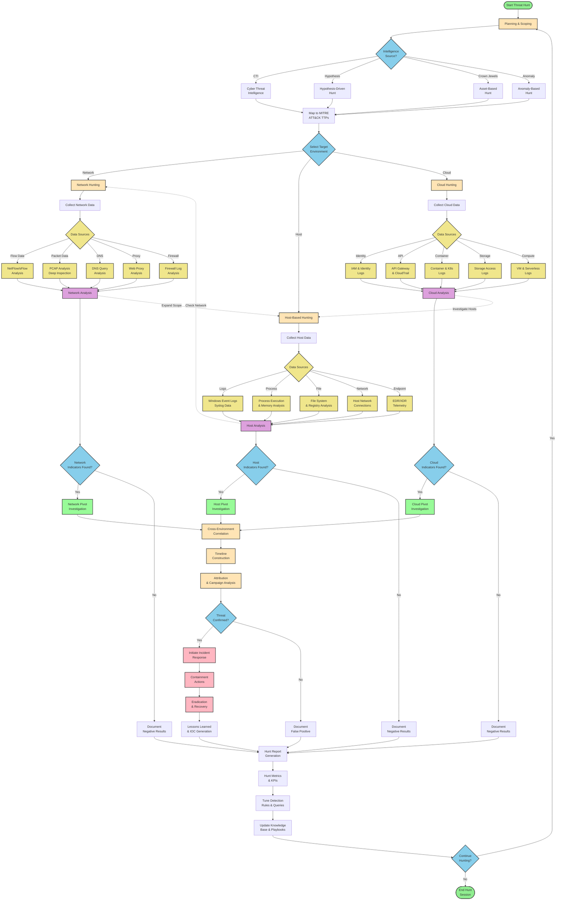

# Proactive Threat Hunting Workflow

A comprehensive threat hunting workflow covering network, host, and cloud environments based on industry frameworks like MITRE ATT&CK, NIST CSF, and open source threat hunting methodologies.

## Complete Threat Hunting Workflow

## Key Components Explained

### **1. Planning & Intelligence Phase**
- **CTI Integration**: Leverage threat intelligence feeds and reports
- **MITRE ATT&CK Mapping**: Map threats to specific tactics, techniques, and procedures
- **Hypothesis Development**: Create testable hypotheses based on threat landscape
- **Asset Prioritization**: Focus on crown jewel systems and critical infrastructure

### **2. Network Hunting**
- **Flow Analysis**: NetFlow, sFlow, IPFIX for traffic patterns
- **Deep Packet Inspection**: Full packet capture analysis
- **DNS Analysis**: DNS queries, tunneling, DGA detection
- **Web Traffic**: Proxy logs, HTTP/HTTPS analysis
- **Perimeter Security**: Firewall, IDS/IPS logs

### **3. Host-Based Hunting**
- **Event Log Analysis**: Windows Security, System, Application logs
- **Process Monitoring**: Execution chains, parent-child relationships
- **File System Forensics**: File creation, modification, deletion patterns
- **Memory Analysis**: Running processes, network connections
- **Endpoint Detection**: EDR/XDR telemetry and behavioral analysis

### **4. Cloud Environment Hunting**
- **Identity & Access**: IAM policies, authentication events
- **API Activity**: CloudTrail, API gateway logs
- **Container Security**: Kubernetes audit logs, container runtime
- **Data Access**: S3, blob storage access patterns
- **Compute Resources**: VM, serverless function activities

### **5. Analysis & Correlation**
- **Cross-Environment Correlation**: Link indicators across domains
- **Timeline Construction**: Build attack timeline and progression
- **Attribution Analysis**: Link to known threat actors or campaigns

### **6. Response & Improvement**
- **Incident Response**: Trigger IR processes for confirmed threats
- **Documentation**: Record findings, false positives, lessons learned
- **Metrics & Tuning**: Measure hunt effectiveness, improve detection rules
- **Knowledge Management**: Update playbooks and hunting techniques

## Hunt Types Supported

### **Hypothesis-Driven**
- Based on specific threat intelligence or attack scenarios
- Focused hunting with clear objectives

### **Baseline Anomaly**
- Deviation from normal behavioral patterns
- Statistical analysis of historical data

### **Intelligence-Driven**
- CTI feeds, IOCs, TTPs from external sources
- MITRE ATT&CK technique hunting

### **Crown Jewel**
- Asset-focused hunting on critical systems
- High-value target protection
