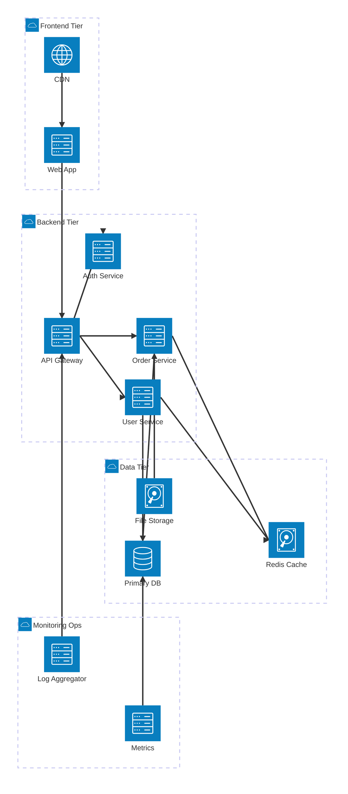
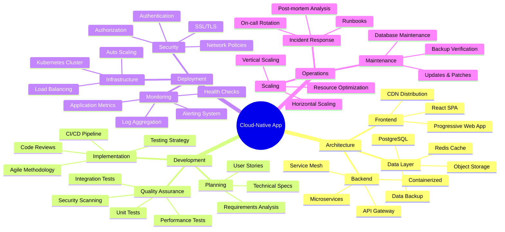

# Cloud-Native Application Architecture & Planning

This document combines an architecture diagram showing the technical infrastructure with a mindmap outlining the development and deployment strategy.

## System Architecture

## Development & Deployment Strategy

## Key Components Explained

### Architecture Tiers:
- **Frontend Tier**: User-facing applications and content delivery
- **Backend Tier**: Business logic and API services
- **Data Tier**: Persistent storage and caching layers
- **Monitoring & Ops**: Observability and operational tools

### Development Strategy:
- **Agile Development**: Iterative development with continuous feedback
- **Microservices**: Loosely coupled, independently deployable services
- **DevOps**: Automated CI/CD with infrastructure as code
- **Security**: Built-in security practices throughout the lifecycle

This combination provides both the technical view (architecture) and the strategic view (mindmap) of a modern cloud-native application.
